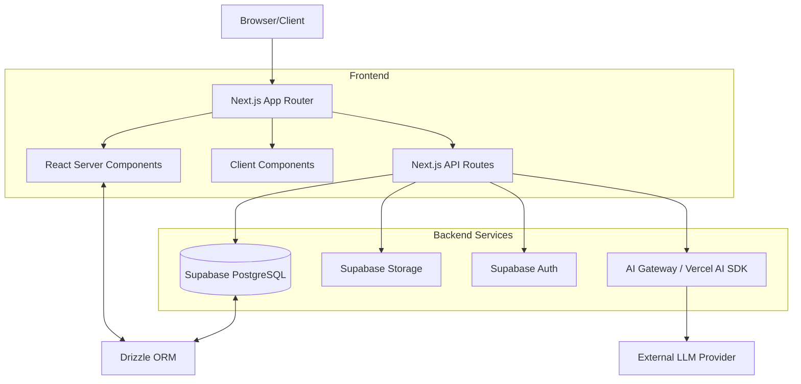
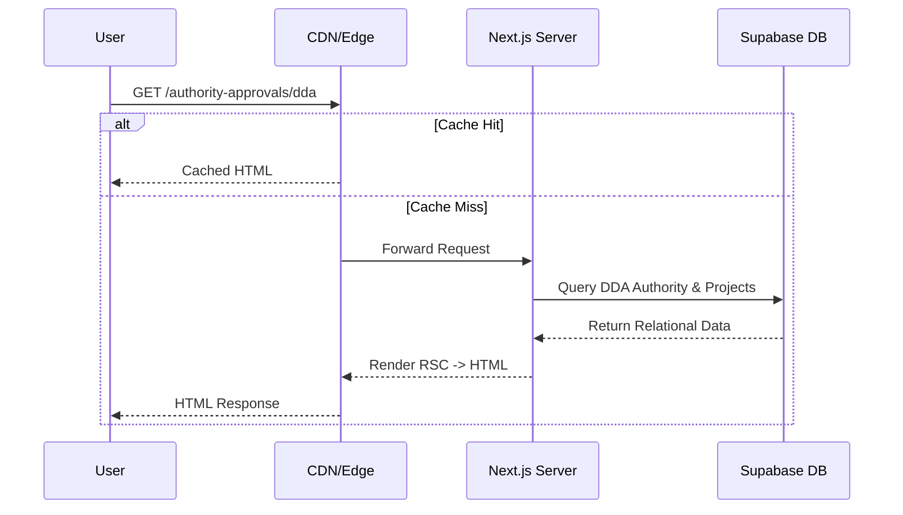
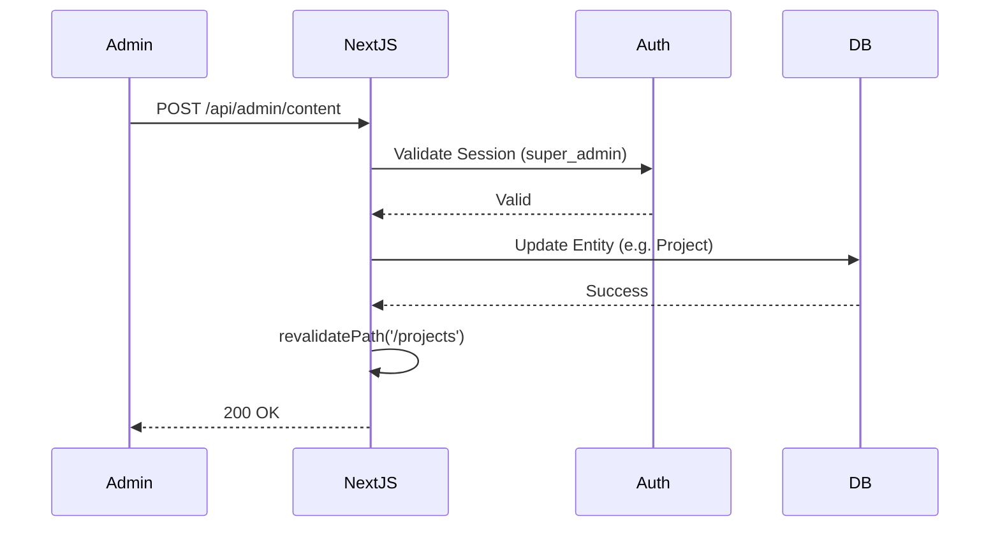
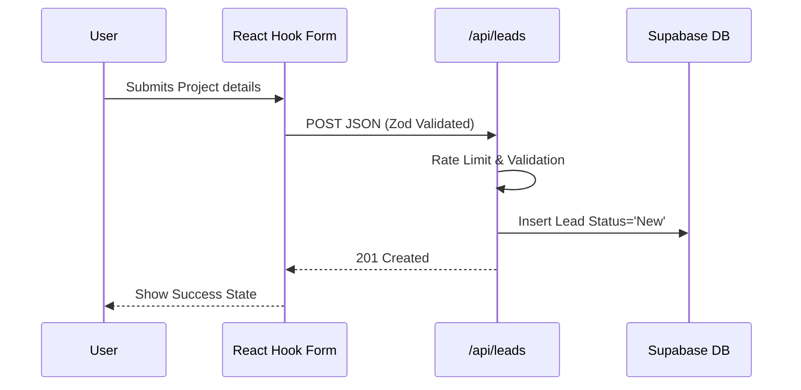
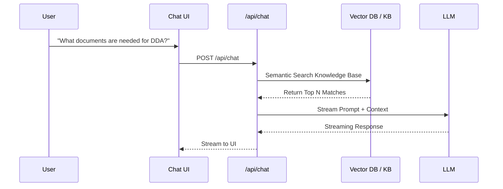
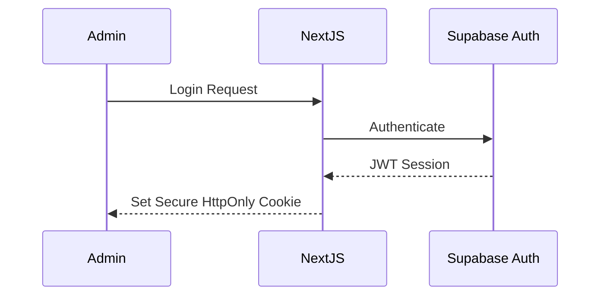
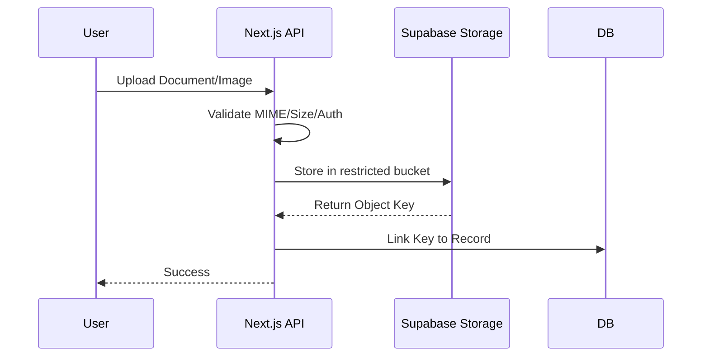
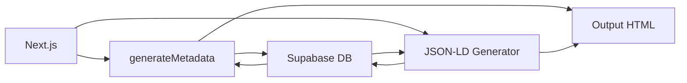

# System Architecture

## 1. Overview
The Goldland Contracting Digital Platform is a highly performant, SEO-optimized, CMS-backed web application. It transitions the company from a static brochure site into a dynamic "Topical Authority Model" capturing search intent across all Dubai authority jurisdictions.

## 2. Architecture Diagrams

### A. System Architecture

### B. Request Flow

### C. CMS Flow

### D. Lead Flow

### E. AI Chatbot Flow

### F. Authentication Flow

### G. File Upload Flow

### H. SEO Rendering Flow

