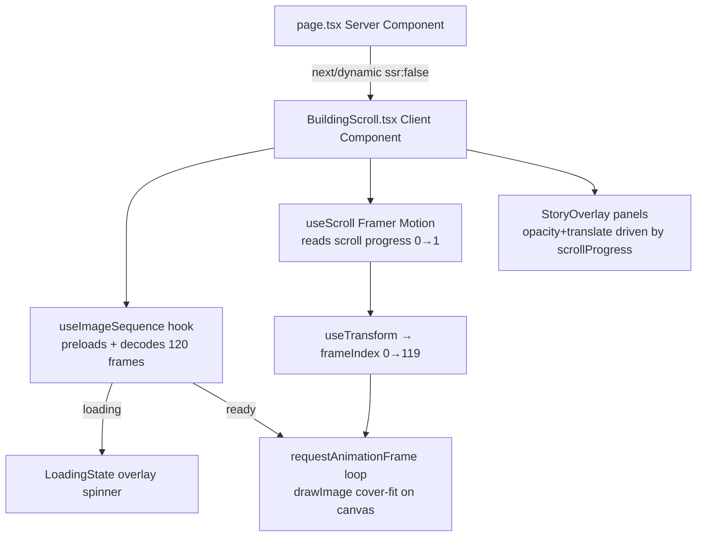
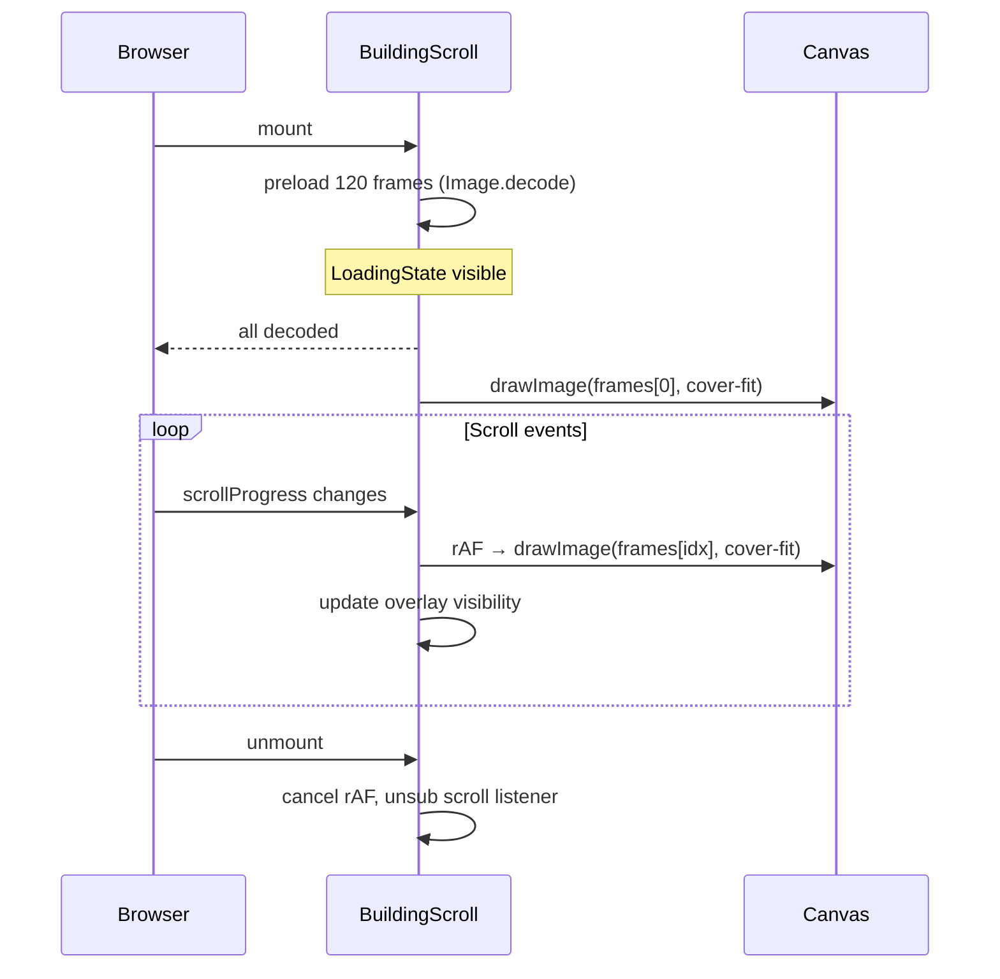

# Design Document — Hero Scrollytelling Animation

## Overview

This feature replaces the existing looping video hero in `web/src/app/page.tsx` with a scroll-linked canvas
animation ("scrollytelling"). A 120-frame WebP image sequence (`/public/shard/shard_frame_0.webp` …
`shard_frame_119.webp`) simulates a cinematic camera flight up The Shard building. Scroll progress drives
frame selection on an HTML5 `<canvas>`, overlaid editorial text panels fade in/out at defined scroll
thresholds, and a minimalist spinner is shown until all frames are decoded.

The visual language is "fog/editorial light": `#F3F4F6` mist background, black typography, no gradient
overlays. The implementation targets Next.js 14 App Router with Framer Motion (already installed) and
touches exactly three files:

| File | Action |
|------|--------|
| `web/src/components/BuildingScroll.tsx` | **Create** — owns all canvas/scroll/overlay logic |
| `web/src/app/page.tsx` | **Modify** — swap hero section for `<BuildingScroll>` |
| `web/src/app/globals.css` | **Modify** — add `.scrollytelling-hero` class |

### Key design decisions

- **Canvas instead of `` swapping** — Canvas `drawImage` batched inside `requestAnimationFrame`
  is substantially smoother than swapping `src` on 120 `` elements; avoids decode stalls and layout
  shift entirely.
- **Framer Motion `useScroll` + `useTransform`** — already available in the project (`framer-motion@13`).
  `useScroll` with `target` ref gives a clean `[0, 1]` `MotionValue` without manual `scroll` listeners.
- **`next/dynamic` with `ssr: false`** — Canvas and `window` APIs do not exist on the server; SSR must be
  opted out to prevent hydration errors.
- **`Image.decode()`** — guarantees each frame is fully rasterised before being marked ready, preventing
  partial-pixel draws mid-scroll.

---

## Architecture





---

## Components and Interfaces

### `BuildingScroll` (new — `web/src/components/BuildingScroll.tsx`)

```typescript
"use client";

export interface StoryPanel {
  headline: string;
  subCopy: string;
  entryThreshold: number; // ScrollProgress ∈ [0,1] when panel fades in
  exitThreshold: number;  // ScrollProgress when panel fades out
  align: "center" | "left" | "right";
}

// Internal shape — not exported
interface UseImageSequenceReturn {
  frames: HTMLImageElement[];   // fully decoded frames (length = 120 when loaded)
  loaded: boolean;              // true when all 120 decoded
  error: string | null;         // first error path if any
}

// Component signature
export default function BuildingScroll(): JSX.Element
```

**Internal hooks used by the component:**

| Hook / helper | Source | Purpose |
|---|---|---|
| `useScroll` | `framer-motion` | `scrollYProgress` MotionValue (0→1) for the outer container |
| `useTransform` | `framer-motion` | Map progress → frame index (0→119) |
| `useReducedMotion` | `framer-motion` | Honour `prefers-reduced-motion` |
| `useRef` | `react` | Refs: outer container, `<canvas>` element, loaded images array, rAF handle |
| `useEffect` | `react` | Preload sequence; resize handler; visibility change handler; cleanup |

### `StoryPanel` static config

Defined as a constant array inside `BuildingScroll.tsx` (not fetched from CMS):

```typescript
const STORY_PANELS: StoryPanel[] = [
  { headline: "The Monolith.",        subCopy: "Rising above the clouds.",          entryThreshold: 0.00, exitThreshold: 0.20, align: "center" },
  { headline: "Faceted Glass.",       subCopy: "Catching the golden hour light.",   entryThreshold: 0.30, exitThreshold: 0.55, align: "left"   },
  { headline: "Precision Geometry.", subCopy: "Engineering at absolute scale.",    entryThreshold: 0.65, exitThreshold: 0.85, align: "right"  },
  { headline: "The Pinnacle.",        subCopy: "Scroll back to descend.",           entryThreshold: 0.95, exitThreshold: 1.00, align: "center" },
];
```

### Modifications to `page.tsx`

- Remove: `<section className="force-dark relative …">` (the `<video>` + `<Hero3D>` block)
- Add: `import dynamic from "next/dynamic"` and dynamic import of `BuildingScroll`
- Add: loading placeholder `<div style={{ height: "100vh", backgroundColor: "#F3F4F6" }} />`
- All sections below the hero (`<ScrollStoryVideo>`, authority grid, etc.) remain unchanged.

### Additions to `globals.css`

```css
/* Scrollytelling hero — fog/editorial light theme */
.scrollytelling-hero {
  background: #F3F4F6;
  overflow: hidden;
}
```

The Inter font is already available via the project's `next/font` setup or system sans-serif fallback; no
additional import is required.

---

## Data Models

### Frame index computation

```
frameIndex = clamp(Math.round(scrollProgress × 119), 0, 119)
```

Where `scrollProgress` is a `MotionValue<number>` in `[0, 1]` from Framer Motion's `useScroll` targeting
the outer `400vh` container element.

### Cover-fit draw parameters

Given:
- `imgW`, `imgH` — intrinsic image dimensions (same for all frames in the sequence)
- `canvasW`, `canvasH` — physical canvas pixel dimensions (`viewport × DPR`)

```
scale  = max(canvasW / imgW, canvasH / imgH)
drawW  = imgW × scale
drawH  = imgH × scale
offsetX = (canvasW − drawW) / 2
offsetY = (canvasH − drawH) / 2

ctx.drawImage(image, offsetX, offsetY, drawW, drawH)
```

This is the exact CSS `object-fit: cover` equivalent for Canvas.

### Overlay visibility state

Each panel is **active** when:
```
scrollProgress >= panel.entryThreshold && scrollProgress < panel.exitThreshold
```

Framer Motion `animate` controls are used per-panel to drive `opacity` (0→1 or 1→0) and
`y` (`+15px`→`0px` on enter, `0px`→`-15px` on exit) with `duration` 0.4 s / 0.3 s respectively.

### DPR-aware canvas sizing

```
canvas.width  = Math.floor(window.innerWidth  × window.devicePixelRatio)
canvas.height = Math.floor(window.innerHeight × window.devicePixelRatio)
canvas.style.width  = "100vw"
canvas.style.height = "100vh"
```

Re-run inside a debounced (200 ms) `resize` handler. After resize, re-draw the current frame at the new
dimensions.

### Reduced motion behaviour

When `useReducedMotion()` returns `true`:
- Only Frame 0 is drawn statically; the scroll subscription is established but `drawImage` is never called
  again (frame index locked at 0).
- All `StoryOverlay` panels are rendered statically visible (Panel 1 only, opacity 1) with no animation.

---

## Correctness Properties

*A property is a characteristic or behavior that should hold true across all valid executions of a system — essentially, a formal statement about what the system should do. Properties serve as the bridge between human-readable specifications and machine-verifiable correctness guarantees.*

### Property 1: Frame index stays in bounds for any scroll progress

*For any* `scrollProgress` value in the continuous range [0, 1], the computed frame index SHALL be an
integer in the closed range [0, 119].

**Validates: Requirements 3.2**

---

### Property 2: Cover-fit preserves full canvas coverage

*For any* combination of canvas dimensions (width, height) and image intrinsic dimensions (imgW, imgH),
the cover-fit algorithm SHALL produce draw parameters such that the drawn image fully covers every pixel
of the canvas (no letterboxing) and the horizontal centre of the image is aligned with the horizontal
centre of the canvas.

**Validates: Requirements 3.5, 6.5**

---

### Property 3: Overlay active range is disjoint from inactive range

*For any* `scrollProgress` and any `StoryPanel`, the panel SHALL be classified as active (opacity 1) XOR
inactive (opacity 0) — never simultaneously active and invisible, and never simultaneously inactive and
visible — once the transition animation has completed.

**Validates: Requirements 4.2, 4.3**

---

### Property 4: Frame index is monotonically consistent with scroll direction

*For any* two scroll-progress values `p1 < p2`, the frame index derived from `p1` SHALL be ≤ the frame
index derived from `p2` (i.e., the mapping is non-decreasing). Scrolling forward never decrements the
frame counter, and scrolling backward never increments it.

**Validates: Requirements 3.2, 3.3**

---

### Property 5: Canvas pixel dimensions scale linearly with DPR

*For any* viewport size (width, height) and device pixel ratio DPR > 0, the canvas internal pixel
dimensions SHALL equal `floor(width × DPR)` × `floor(height × DPR)`, while the CSS display dimensions
remain `100vw × 100vh`.

**Validates: Requirements 1.3**

---

## Error Handling

| Scenario | Behaviour |
|---|---|
| Individual frame fails to load (`onerror`) | `console.warn` with the failed path; frame slot is marked `null`; loading continues for remaining frames; the canvas draw function skips `null` slots. |
| All frames fail | `loaded` remains `false`; LoadingState stays visible; canvas never draws. |
| `window` / Canvas not available (SSR) | Component is excluded from SSR via `next/dynamic { ssr: false }`; no server-side code path touches these APIs. |
| Browser tab hidden | Pending `requestAnimationFrame` is cancelled via `cancelAnimationFrame`; resumed on `visibilitychange` event. |
| Component unmount before load completes | `useEffect` cleanup sets an `isCancelled` flag; `onload`/`decode` callbacks check the flag before updating state. All rAF handles and event listeners are removed. |
| Resize during preload | Resize handler fires but only re-draws if `loaded === true`; otherwise no-op. |

---

## Testing Strategy

### Unit tests (Vitest + React Testing Library)

These verify specific behaviour with concrete inputs:

| Test | What is verified |
|---|---|
| `frameIndex(0)` returns `0` | Lower bound clamping |
| `frameIndex(1)` returns `119` | Upper bound clamping |
| `frameIndex(0.5)` returns `60` | Mid-point mapping |
| `coverFit(800, 600, 1920, 1080)` covers full canvas | Cover-fit correctness example |
| `coverFit(1920, 1080, 800, 600)` covers full canvas | Landscape-to-portrait cover |
| Loading state renders before frames ready | Component integration |
| All overlays hidden when `prefers-reduced-motion` | Accessibility compliance |
| `onError` for one frame logs warning and continues | Error resilience |

### Property-based tests (fast-check, minimum 100 iterations each)

The project currently has no property-based testing library installed; `fast-check` should be added as a
dev dependency (`npm install --save-dev fast-check`).

Each property test is tagged with a comment referencing the design property:

```
// Feature: hero-scrollytelling-animation, Property {N}: {property_text}
```

| Property | Generator | What is asserted |
|---|---|---|
| **Property 1** — Frame index in bounds | `fc.float({ min: 0, max: 1 })` for scrollProgress | `result >= 0 && result <= 119 && Number.isInteger(result)` |
| **Property 2** — Cover-fit full coverage | `fc.tuple(fc.integer({min:1,max:4096}), fc.integer({min:1,max:4096}), fc.integer({min:1,max:4096}), fc.integer({min:1,max:4096}))` for (canvasW, canvasH, imgW, imgH) | Drawn rect completely encloses canvas rect; horizontal centre of drawn rect equals canvas centre |
| **Property 3** — Overlay XOR | `fc.float({min:0,max:1})` × 4 panel configs | For each panel, `isActive(progress, panel) XOR !isActive(progress, panel)` — tautology; real check: isActive is true iff `p >= entry && p < exit`, never both simultaneously |
| **Property 4** — Monotone frame index | `fc.tuple(fc.float({min:0,max:1}), fc.float({min:0,max:1}))`.map sort to `[p1,p2]` | `frameIndex(p1) <= frameIndex(p2)` whenever `p1 <= p2` |
| **Property 5** — DPR canvas sizing | `fc.tuple(fc.integer({min:320,max:3840}), fc.integer({min:240,max:2160}), fc.float({min:0.5,max:4}))` | `canvasW === Math.floor(vw × dpr) && canvasH === Math.floor(vh × dpr)` |

### Integration / smoke tests (manual or Playwright)

- Visual check: LoadingState spinner visible on first load, disappears after frames decode.
- Visual check: scrolling from top to bottom advances through all 120 frames with no flicker.
- Accessibility: `prefers-reduced-motion` in OS settings shows only Frame 0, no text animation.
- CLS: Lighthouse run confirms CLS = 0 (outer container height pre-established).
- Mobile: 375 px viewport shows building spire centred, no horizontal scroll.
